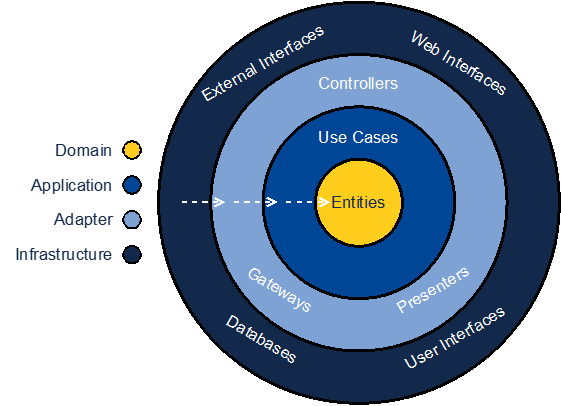

# Banking System

This is the code for a very simple banking system.
The system contains only one code file (``app.py``) with an command line interface to ``donate`` money from one account to another or ``withdraw`` money from one account. We also have some predefined bank accounts, that can interact with the system and apply these two use cases.

# Your task

The system only has one main function. However, in future we plan to add new use cases (e.g., ``loan``), change the data storage (e.g., from ``sqlite`` to ``postgresql``) or add another interface for the system (e.g., ``web api``)

We want to be independent from any technology and third-party frameworks.
In the end you should have a `onion architecture`-like structure with packages for ``infrastructure``, ``application`` and ``domain``. Keep in mind that the ``domain model`` and ``application`` should not have any external dependencies and all dependencies should be directed inwards.



# Prerequisites

1. Install Python (>= 3.9)
2. Create a virtual environment  
  ```python -m venv .venv```
3. Activate the virtual environment  
  ```source .venv/bin/activate``` (Linux) or ``.venv/Scripts/activate`` (Windows)
4. Install all requirements  
  ```pip install -r requirements.txt```

# Run the system

You can run the system by executing ``python app.py <arguments>``. 

To get all available commands you can execute ``python app.py --help``.
